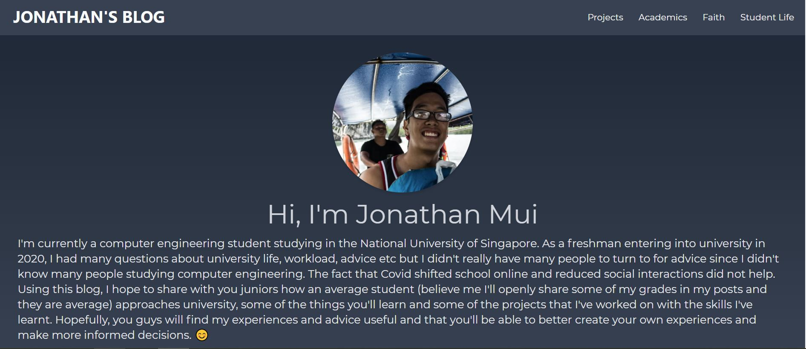
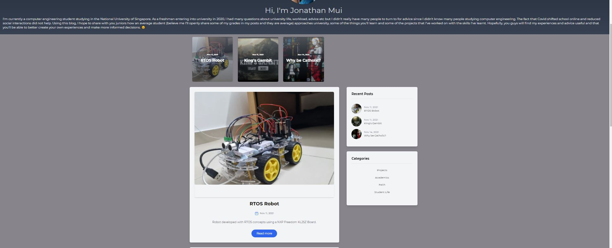
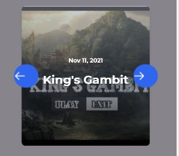
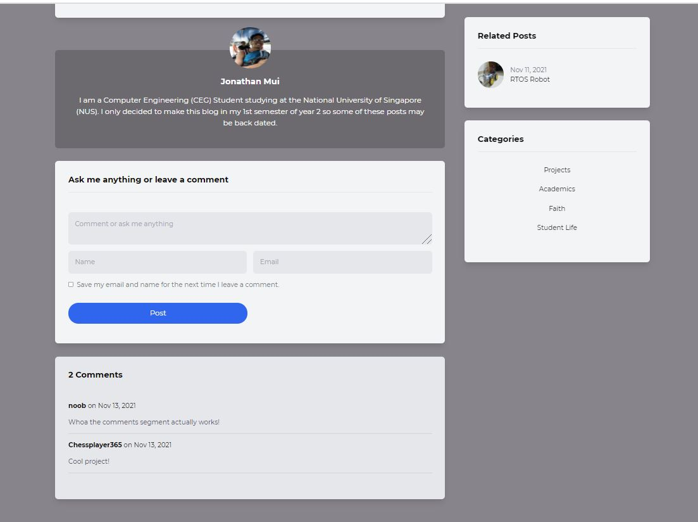
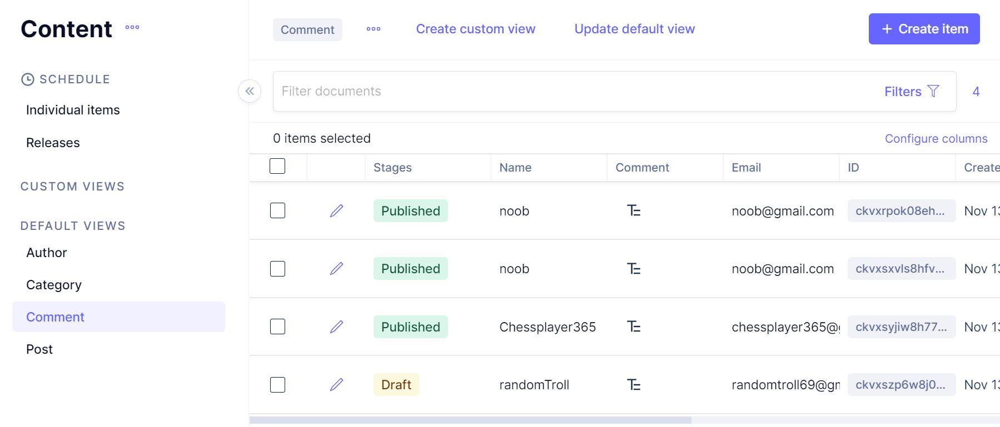
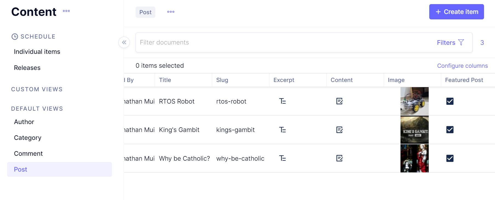

# Personal Blog Site

## Credits

This project would not have been possible without the guidance and kindness of the following instructors:
- [Javascript Mastery Youtube Tutorial](https://www.youtube.com/watch?v=HYv55DhgTuA&ab_channel=JavaScriptMastery)
- [Academind Nextjs Course](https://pro.academind.com/p/nextjs-react-the-complete-guide)

## Tech stacks and frameworks

- Nextjs and React
- Tailwind CSS
- Graphql
- Graph CMS

## Features

### Responsive design 

**Desktop home page:**

**Mobile home page:**

### Comments segment for visitors

### Content Management with Graph CMS

**Filter Comments using Graph cms to ensure only acceptable comments are posted:**

**Manage blog content without editting the code**

